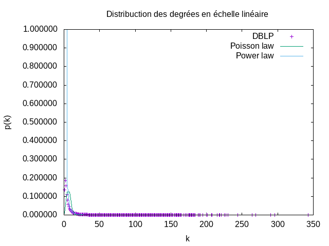
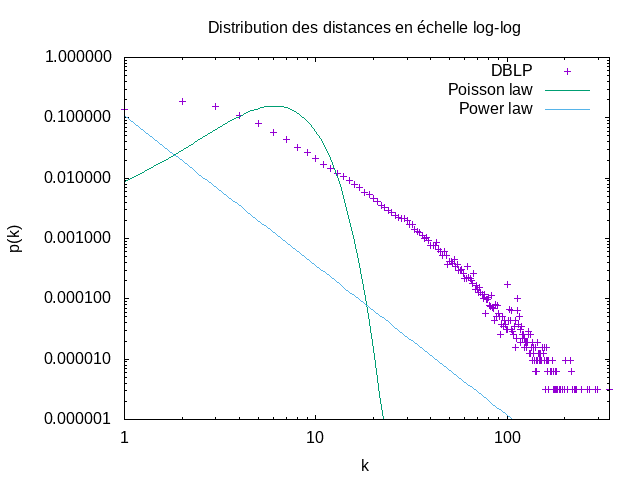
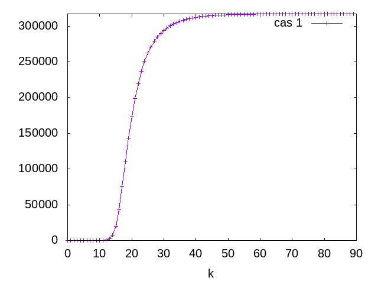
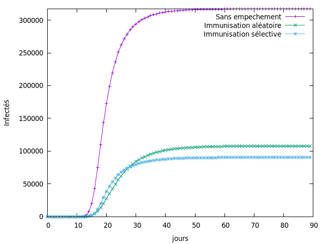

## TP1: Mesures de réseaux d'interaction

Nous allons analyser un réseau de collaboration scientifique en informatique. Le réseau est extrait de DBLP et disponible sur [SNAP](https://snap.stanford.edu/data/com-DBLP.html).GraphStream permet de mesurer de nombreuses caractéristiques d'un réseau. La plupart de ces mesures sont implantées comme des méthodes statiques dans la classe [`Toolkit`](https://data.graphstream-project.org/api/gs-algo/current/org/graphstream/algorithm/Toolkit.html). Elles vous seront très utiles par la suite.

1. Commencez par télécharger les données et les lire avec GraphStream. GraphStream sait lire ce format. Voir [`FileSourceEdge`](https://data.graphstream-project.org/api/gs-core/current/org/graphstream/stream/file/FileSourceEdge.html) et ce [tutoriel](http://graphstream-project.org/doc/Tutorials/Reading-files-using-FileSource/). Vous pouvez essayer de visualiser le graphe mais pour cette taille ça sera très lent et très peu parlant.

2. Prenez quelques mesures de base: nombre de nœuds et de liens, degré moyen, coefficient de clustering. Quel sera le coefficient de clustering pour un réseau aléatoire de la même taille et du même degré moyen ?

#### Mesures de base

Après calcul par appel des méthodes de Toolkit, on a obtenu les mesures suivants:

| Mesures  | Valeur  | Signification  |
|---|---|---|
|N   | 317080  | Nombre de noeuds  |
|L   | 1049866  | Nombre de liens  |
| < k >  | 6.622  | Degré moyen  |
| < C >  | 0.632  | Coefficient de clustering  |

Pour un réseau aléatoire de la même taille et du même degré moyen, la coefficient de clustering est d'après la formule:
Ci = < k > / N  qui est : **2.08 E-5**.

3. Le réseau est-il connexe ? Un réseau aléatoire de la même taille et degré moyen sera-t-il connexe ? À partir de quel degré moyen un réseau aléatoire avec cette taille devient connexe ?

La probabilité pour un noeud prix au hasard pour un réseau aléatoire soit conneccté à son voisinage est minime par rapport à notre réseau DBLP.

La méthode **Toolkit.isConnected(graph)** nous retourne Vrai, cela nous indique la connexité de notre réseau.  
  
Par contre un réseau aléatoire de la même taille et degré moyen ne sera connexe qu'à partir d'un certain degré moyen **< k >** supérieur à **ln N = 12,66**

4. Calculez la distribution des degrés et tracez-la avec `gnuplot` (ou avec votre outil préféré) d'abord en échelle linéaire, ensuite en échelle log-log. Est-ce qu'on observe une ligne droite en log-log ? Que cela nous indique ? Tracez la distribution de Poisson avec la même moyenne pour comparaison. Utilisez la commande `fit` de `gnuplot` pour trouver les coefficients de la loi de puissance et tracez-la.
  

#### Distribution des degrés  

En utilisant gnuplot pour afficher nos résultat dans le fichier **dd_dblp.dat**, on obtient l'image suivante une échelle linéaire:
  
  
En échelle la distribution suivante en échelle Log-Log on pour mieux décrire notre réseau.  


*La distribution des degrées indique la probabilité qu'un noeud ait k liens*   


On peut observe ainsi une droite sur cette dernière échelle. Cette droite est en effet la représentation de la **Loi de Puissance** 
qui correspond au mieux à notre distribution de degré.   

```math
    p_k = C k^{-\gamma}
```

On peut en soutirer que notre réseau est un réseau de terrain.

* En estimant la distance moyenne par échantillonnage par un parcours en largeur à partir de 1000 sommets choisis au hasard, on obtient une valeur de 6.832.  
* Ainsi l'hypothèse des **six degrés de séparation** est confirmé. Notre réseau est un petit monde.
* Dans un réseau aléatoire de même caractéristiques, la distance moyenne sera de **6.78**.

5. Maintenant on va calculer la distance moyenne dans le réseau. Le calcul des plus courts chemins entre toutes les paires de nœuds prendra plusieurs heures pour cette taille de réseau. C'est pourquoi on va estimer la distance moyenne par échantillonnage en faisant un parcours en largeur à partir de 1000 sommets choisis au hasard. L'hypothèse des six degrés de séparation se confirme-t-elle ? Est-ce qu'il s'agit d'un réseau petit monde ? Quelle sera la distance moyenne dans un réseau aléatoire avec les mêmes caractéristiques ? Tracez également la *distribution* des distances. Formulez une hypothèse sur la loi de cette distribution.

#### Distribution des distances

Pour savoir s'il s'agit d'un réseau "petit monde", il suffit de vérifier que $`\langle d \rangle = d_{max}`$ où $`d_{max} = \frac{\ln N}{\ln \langle k \rangle}`$.
   


6. Utilisez les générateurs de GraphStream pour générer un réseau aléatoire et un réseau avec la méthode d'attachement préférentiel (Barabasi-Albert) qui ont la même taille et le même degré moyen. Refaites les mesures des questions précédentes pour ces deux réseaux. Les résultats expérimentaux correspondent-ils aux prédictions théoriques ? Comparez avec le réseau de collaboration. Que peut-on conclure ?

#### Génération d'un réseau aléatoire avec une méthode d'attachement préférentiel (Barabasi-Albert)
Avec une telle méthode on obtient les mêmes valeurs sauf la connexité et le coefficient de Clustering


> Graphe aléatoire :

  | Mesures               | Résultats |
  | :-------------------- | :-------: |
  | $`N`$                 |  317088   |
  | $`L`$                 |  1110910  |
  | $`\langle k \rangle`$ | 7.0069508 |
  | $`\langle C \rangle`$ | 2.1839707 |
    

    


> Graphe préférentiel :

  | Mesures               | Résultats |
  | :-------------------- | :-------: |
  | $`N`$                 |  317082   |
  | $`L`$                 |  1267243  |
  | $`\langle k \rangle`$ | 7.9931564 |
  | $`\langle C \rangle`$ | 4.8840521 |
    
    


##Question 7
 - Le generateur WattsStrogatzGenerator nous reproduit un coefficient de clustering plus petite avec un réseau connexe.
 - Le nombre d'arrêt dépend de la probabilité.

##TP2:Propagation dans un réseau
Les consignes sont les mêmes que pour le premier TP. On travaille sur les mêmes données et la problématique est proche. ([SNAP](https://snap.stanford.edu/data/com-DBLP.html))

Nos collaborateurs scientifiques communiquent souvent par mail. Malheureusement pour eux, les pièces jointes de ces mails contiennent parfois des virus informatiques. On va étudier la propagation d'un virus avec les hypothèses suivantes :

- Un individu envoie en moyenne un mail par semaine à chacun de ses collaborateurs.
- Un individu met à jour son anti-virus en moyenne deux fois par mois. Cela nettoie son système mais ne le protège pas de nouvelles infections car le virus mute.
- L'épidémie commence avec un individu infecté (patient zéro).

1. Quel est le taux de propagation du virus ? 

On a $`\beta = \frac{1}{7}`$ pour la probabilité de contaminer un collaborateur et $`\mu = \frac{1}{14}`$ pour la probabilité de mettre à jour son anti-virus.De ce fait, le taux de propagation $`\lambda = \frac{\beta}{\mu} = 2`$  

Donc Le rapport entre beta et mu nous donne le taux de propagation dans le réseau.  
 **beta = 1/7** car un individu envoie un mail par semaine en moyenne  
 **mu = 1/14** car la mise à jour de l'anti-virus est faite deux fois par mois donc 1 fois toutes les deux semaines.
 
2. Quel est le seuil épidémique du réseau ?

On peut avoir le seuil avec $`\lambda c = \frac{\langle k \rangle}{\langle k^2 \rangle}`$ où $`\langle k \rangle = 6.622`$ et $`\langle k^2 \rangle = 144,631`$ qui vaut $`\lambda c \approx 0.046`$.

Donc Le seuil épidémique du réseau de collaboration = 0.046

3. Comparez avec le seuil théorique d'un réseau aléatoire du même degré moyen.

Le seuil épidémique d'un réseau aléatoire au même degré moyen serait $`\lambda c = \frac{1}{\langle k \rangle + 1} \approx 0.131`$.  Cette différence entre les seuils épidémique est dûe à la divergence du degré de clustering.

Donc le seuil épidémique du réseau aléatoire = 0.131
 
Simulez la propagation du virus jour par jour pendant trois mois avec les scénarios suivants :

- On ne fait rien pour empêcher l'épidémie
- On réussit à convaincre 50 % des individus de mettre à jour en permanence leur anti-virus (immunisation aléatoire)
- On réussit à convaincre 50 % des individus de convaincre un de leurs contacts de mettre à jour en permanence son anti-virus (immunisation sélective).

Le seuil épidémique du réseau avec stratégies d'immunisation aleatoire = 0.088

Le seuil épidémique du réseau avec stratégies d'immunisation seclective = 0.166

4. Pour chacun des trois scénarios, tracez l'évolution de la fraction d'infectés de la population non immunisée.


5. Que peut-on conclure ?

Pour le cas de l'immunisation aléatoire, dans des conditions normales de simulation, on observe au mieux un ralentissement de la propagation du virus. Au contraire, la sélective permet d'entraver la propagation malgrès le fait que le nombre de noeuds immunisés soit inférieur ou égal à celui des immunisés aléatoirement. 


6. Pour justifier l'efficacité de l'immunisation sélective, calculez le degré moyen des groupes 0 et 1.

    $`\langle k \rangle (0) = 6.620`$
   
    $`\langle k \rangle (1) = 11.370`$

7. Comment expliquez-vous la différence ?

    Le groupe 1 manifeste une présence supérieur de hubs car ils ont une probabilité élevé d'être immunisés par un de leurs voisins.

8.  Du point de vue du virus l'immunisation d'un nœud est équivalente à sa suppression du réseau. Calculez le seuil épidémique du réseau modifié pour chacune des deux stratégies d'immunisation et comparez avec le seuil épidémique du réseau initial.


    $`\lambda c(aléatoire) \approx 0.046`$\
    $`\lambda c(sélective) \approx 0.093`$

    
    Pour le réseau aléatoire, le seuil épidémique est approximativement égal à celui du réseau initial car la taille du réseau n'a pas d'influence sur son seuil épidémique.Alors que le réseau sélectif a un seuil épidémique environ deux fois plus grand que les autres. On peut justifier cela par le fait qu'un grand nombre de hub soient retirés du réseau et donc limite la propagation.

9.  Simulez l'épidémie avec les mêmes hypothèses et les mêmes scénarios dans un réseau aléatoire et un réseau généré avec la méthode d'attachement préférentiel de la même taille et le même degré moyen. Comparez et commentez les résultats.

En utilisant gnuplot pour afficher nos résultat dans le fichier **epidemic_first_case.dat**, on obtient l'image suivante une échelle linéaire:
* la première simulation
  

* la simulation avec tout les cas



